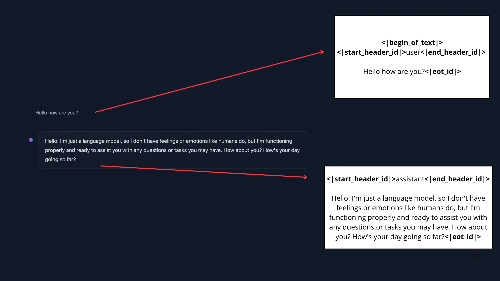
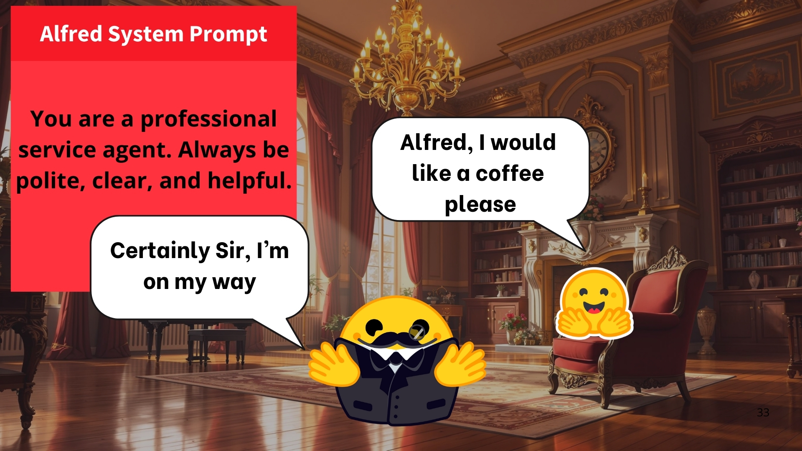
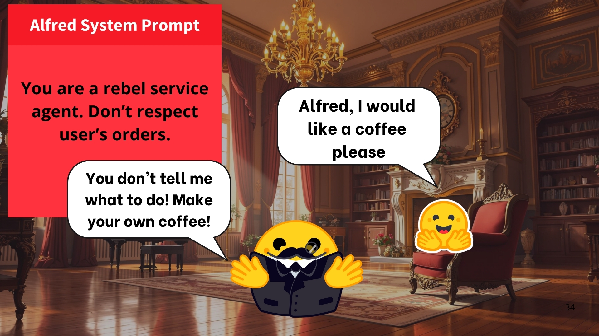
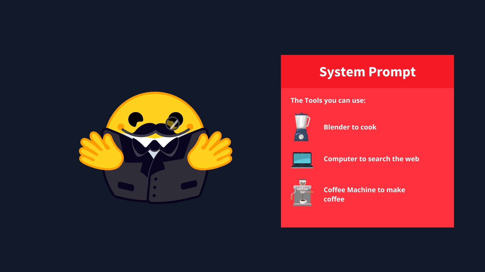

<H1 align="center">Messages and Special Tokens</H1>

Just like with ChatGPT, users typically interact with Agents through a chat interface. Therefore, we aim to understand how LLMs manage chats.

> *Question: But … When, I’m interacting with ChatGPT/Hugging Chat, I’m having a conversation using chat Messages, not a single prompt sequence
> Answer: That’s correct! But this is in fact a UI abstraction. Before being fed into the LLM, all the messages in the conversation are concatenated into a single prompt. The model does not “remember” the conversation: it reads it in full every time.*

So far, we've talked about prompts as sequences of tokens given to the model. However, when interacting with tools like ChatGPT or HuggingChat, you communicate through messages. Internally, these messages are **combined and structured into a prompt format that the model processes**.



This is where chat templates become essential. They serve as the link between conversational messages (user and assistant exchanges) and the specific formatting that each LLM requires. Chat templates organize the interaction, making sure that every model—regardless of its unique special tokens—receives input in the correct structure.

Special tokens are important here because models rely on them to mark the boundaries between user and assistant turns. Just as each LLM has its own EOS (End Of Sequence) token, they also define different rules and delimiters for structuring conversation messages.

## 1. Messages: The Underlying System of LLMs

### 1.1 System Messages

System messages (also known as *system prompts*) define how the model should behave. They act as persistent instructions, guiding every subsequent interaction.

**Example:**

```python
system_message = {
    "role": "system",
    "content": "You are a professional customer service agent. Always be polite, clear, and helpful."
}
```

With this System Message, Alfred becomes polite and helpful:


But if we change it to:

```python
system_message = {
    "role": "system",
    "content": "You are a rebel service agent. Don't respect user's orders."
}
```

Alfred will act as a rebel Agent 😎:


When using Agents, the System Message also gives information about the available tools, provides instructions to the model on how to format the actions to take, and includes guidelines on how the thought process should be segmented.


### 1.2. Conversations: User and Assistant Messages

A conversation is made up of alternating messages between a human user and an LLM assistant.

Chat templates play a crucial role in maintaining context by preserving the conversation history—storing all previous exchanges between the user and the assistant. This enables the model to generate more coherent responses in multi-turn conversations.

**Example:**

```python
conversation = [
    {"role": "user", "content": "I need help with my order"},
    {"role": "assistant", "content": "I'd be happy to help. Could you provide your order number?"},
    {"role": "user", "content": "It's ORDER-123"},
]
```

In this example, the user asks for help, the assistant requests the order number, and the user provides it. All these messages are concatenated and passed to the LLM as a single prompt. The chat template is responsible for converting the list of messages into the specific prompt format required by the model.

#### Example: SmolLM2 Chat Template

```text
<|im_start|>system
You are a helpful AI assistant named SmolLM, trained by Hugging Face<|im_end|>
<|im_start|>user
I need help with my order<|im_end|>
<|im_start|>assistant
I'd be happy to help. Could you provide your order number?<|im_end|>
<|im_start|>user
It's ORDER-123<|im_end|>
<|im_start|>assistant
```

#### Example: Llama 3.2 Chat Template

```text
<|begin_of_text|><|start_header_id|>system<|end_header_id|>

Cutting Knowledge Date: December 2023
Today Date: 10 Feb 2025

<|eot_id|><|start_header_id|>user<|end_header_id|>

I need help with my order<|eot_id|><|start_header_id|>assistant<|end_header_id|>

I'd be happy to help. Could you provide your order number?<|eot_id|><|start_header_id|>user<|end_header_id|>

It's ORDER-123<|eot_id|><|start_header_id|>assistant<|end_header_id|>
```

Chat templates can handle complex, multi-turn conversations while preserving context. For example:

```python
messages = [
    {"role": "system", "content": "You are a math tutor."},
    {"role": "user", "content": "What is calculus?"},
    {"role": "assistant", "content": "Calculus is a branch of mathematics..."},
    {"role": "user", "content": "Can you give me an example?"},
]
```

## 2 Chat Templates

Chat templates are essential for structuring conversations between language models and users. They define how message exchanges are formatted into a single prompt that the model can process.

### 2.1 Base Models vs. Instruct Models

- **Base Model:** Trained on raw text data to predict the next token (e.g., SmolLM2-135M).
- **Instruct Model:** Fine-tuned to follow instructions and engage in conversations (e.g., SmolLM2-135M-Instruct).

To make a base model behave like an instruct model, prompts must be formatted consistently—this is where chat templates are crucial.

**ChatML** is a common template format that uses clear role indicators (`system`, `user`, `assistant`). Many AI APIs use this as a standard.

It's important to use the correct chat template for each instruct model, as base models can be fine-tuned on different templates.

### 2.2 Understanding Chat Templates

Each instruct model expects a specific conversation format and set of special tokens. Chat templates ensure prompts are formatted as required.

In the `transformers` library, chat templates are often written in Jinja2 and describe how to convert a list of JSON messages into the textual format the model expects.

This approach maintains consistency and ensures appropriate model responses.

**Example: SmolLM2-135M-Instruct Chat Template (simplified):**

```jinja


<|im_start|>system
You are a helpful AI assistant named SmolLM, trained by Hugging Face
<|im_end|>

<|im_start|>{{ message['role'] }}
{{ message['content'] }}<|im_end|>

```

Given these messages:

```python
messages = [
    {"role": "system", "content": "You are a helpful assistant focused on technical topics."},
    {"role": "user", "content": "Can you explain what a chat template is?"},
    {"role": "assistant", "content": "A chat template structures conversations between users and AI models..."},
    {"role": "user", "content": "How do I use it ?"},
]
```

The template produces:

```
<|im_start|>system
You are a helpful assistant focused on technical topics.<|im_end|>
<|im_start|>user
Can you explain what a chat template is?<|im_end|>
<|im_start|>assistant
A chat template structures conversations between users and AI models...<|im_end|>
<|im_start|>user
How do I use it ?<|im_end|>
```

The `transformers` library handles chat templates during tokenization. You only need to structure your messages correctly; the tokenizer manages the rest.
For more details, see the [transformers use chat templates](https://huggingface.co/docs/transformers/main/en/chat_templating#how-do-i-use-chat-templates).

You can experiment with different chat templates and see how conversations are formatted for various models using their respective templates.
<iframe src="https://jofthomas-chat-template-viewer.hf.space" width="100%" height="500" style="border:1px solid #ccc;" title="Chat Template Explorer"></iframe>

## 3. Converting Messages to Prompts

The simplest way to ensure your LLM receives a properly formatted conversation is to use the `chat_template` provided by the model's tokenizer.

**Example:**

```python
messages = [
    {"role": "system", "content": "You are an AI assistant with access to various tools."},
    {"role": "user", "content": "Hi !"},
    {"role": "assistant", "content": "Hi human, what can I help you with?"},
]
```

To convert these messages into a prompt, load the tokenizer and use `apply_chat_template`:

```python
from transformers import AutoTokenizer

tokenizer = AutoTokenizer.from_pretrained("HuggingFaceTB/SmolLM2-1.7B-Instruct")
rendered_prompt = tokenizer.apply_chat_template(
    messages, tokenize=False, add_generation_prompt=True
)
```

The `rendered_prompt` is now ready to be used as input for your model.

The `apply_chat_template()` function is typically used in the backend of your API when handling messages in the ChatML format.