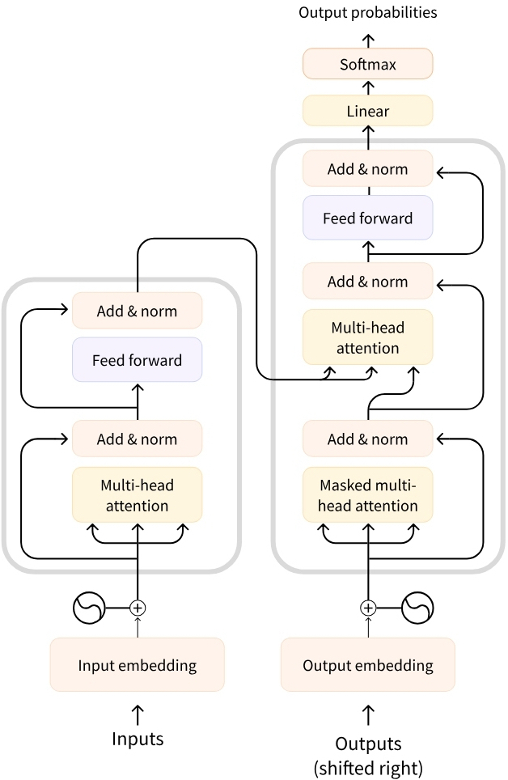

<H1 align="center">Large Language Models (LLMs)</H1>

### 1. What is a Large Language Model?

A **Large Language Model (LLM)** is an advanced artificial intelligence model designed to understand and generate human language. LLMs are trained on extensive text datasets, enabling them to capture linguistic patterns, structures, and subtle nuances. These models are characterized by their large number of parameters—often numbering in the millions or billions.

Modern LLMs are predominantly based on the **Transformer** architecture, which leverages an "Attention" mechanism to process and relate different parts of input text efficiently. This architecture was introduced in the seminal paper ["Attention Is All You Need"](https://arxiv.org/abs/1706.03762) by Vaswani et al. (2017), and has since become foundational for state-of-the-art language models.
<figure>
    
    <figcaption align="center">Figure 1: Diagram of the Transformer Architecture, highlighting the Attention mechanism.</figcaption>
</figure>

### 2. Types of Transformer Architectures

There are three main types of Transformer architectures:

#### (A) Encoder-based Transformers

Encoder-based Transformers process input data and produce dense vector representations (embeddings) of the input. These models are well-suited for understanding and analyzing text.

- **Example:** BERT (Google)
- **Use Cases:** Text classification, semantic search, Named Entity Recognition (NER)
- **Typical Size:** Millions of parameters

#### (B) Decoder-based Transformers

Decoder-based Transformers are designed for generating sequences, producing one token at a time to complete or extend text.

- **Example:** Llama (Meta)
- **Use Cases:** Text generation, chatbots, code generation
- **Typical Size:** Billions of parameters

#### (C) Sequence-to-Sequence (Encoder–Decoder) Transformers

Seq2Seq Transformers combine both an encoder and a decoder. The encoder processes the input into a context representation, which the decoder then uses to generate an output sequence.

- **Examples:** T5, BART
- **Use Cases:** Translation, summarization, paraphrasing
- **Typical Size:** Millions of parameters

> **Note:** While Transformers can take various forms, most Large Language Models (LLMs) are decoder-based architectures with billions of parameters.

##### Examples of Popular LLMs

| Model       | Provider                    |
|-------------|-----------------------------|
| Deepseek-R1 | DeepSeek                    |
| GPT-4       | OpenAI                      |
| Llama 3     | Meta (Facebook AI Research) |
| SmolLM2     | Hugging Face                |
| Gemma       | Google                      |
| Mistral     | Mistral                     |

### 3. How Do LLMs Work? Understanding Tokens and Prediction

The core principle behind an LLM is straightforward yet powerful: its main objective is to predict the next token in a sequence, given the preceding tokens. A **token** is the basic unit of information that an LLM processes. While it is tempting to equate tokens with words, LLMs typically use smaller units for efficiency.

For example, although the English language contains approximately 600,000 words, an LLM like Llama 2 uses a vocabulary of about 32,000 tokens. These tokens are often sub-word fragments that can be combined to form complete words.

**Tokenization Example:**

- The word `interesting` might be split into the tokens `interest` and `ing`.
- The word `interested` could be split into `interest` and `ed`.

This approach allows LLMs to handle a vast range of words and variations efficiently, even those not explicitly seen during training.

Each LLM has some special tokens specific to the model. The LLM uses these tokens to open and close the structured components of its generation. For example, to indicate the start or end of a sequence, message, or response. Moreover, the input prompts that we pass to the model are also structured with special tokens. The most important of those is the End of sequence token (EOS).

The forms of special tokens are highly diverse across model providers.

The table below illustrates the diversity of special tokens.

| Model       | Provider                    | EOS Token            | Functionality                    |
|-------------|-----------------------------|----------------------|----------------------------------|
| GPT-4       | OpenAI                      | `<\|endoftext\|>`    | End of message text              |
| Llama 3     | Meta (Facebook AI Research) | `<\|eot_id\|>`       | End of sequence                  |
| Deepseek-R1 | DeepSeek                    | `<\|end_of_sentence\|>` | End of message text           |
| SmolLM2     | Hugging Face                | `<\|im_end\|>`       | End of instruction or message    |
| Gemma       | Google                      | `<end_of_turn>`      | End of conversation turn         |

We do not need to memorize these special tokens, but it is important to appreciate their diversity and the role they play in the text generation of LLMs. If you want to know more about special tokens, you can check out the configuration of the model in its Hub repository. For example, you can find the special tokens of the SmolLM2 model in its [Hugging Face Hub repository](https://huggingface.co/HuggingFaceTB/SmolLM2-135M-Instruct/blob/main/tokenizer_config.json).

```json
{
  "add_prefix_space": false,
  "added_tokens_decoder": {
    "0": {
      "content": "<|endoftext|>",
      "lstrip": false,
      "normalized": false,
      "rstrip": false,
      "single_word": false,
      "special": true
    },
    "1": {
      "content": "<|im_start|>",
      "lstrip": false,
      "normalized": false,
      "rstrip": false,
      "single_word": false,
      "special": true
    },
    "2": {
      "content": "<|im_end|>",
      "lstrip": false,
      "normalized": false,
      "rstrip": false,
      "single_word": false,
      "special": true
    },
    ....
}
```
> _TRy bellow playground for tokenization_
<iframe src="https://agents-course-the-tokenizer-playground.static.hf.space/index.html" width="100%" height="600" style="border:1px solid #ccc; border-radius:8px;" title="LLM Decoding Visualizer"></iframe>

### 4. Understanding Next Token Prediction

LLMs are said to be **autoregressive**, meaning that the output from one pass becomes the input for the next one. This loop continues until the model predicts the next token to be the EOS (End of Sequence) token, at which point the model can stop.


In other words, an LLM will decode text until it reaches the EOS. But what happens during a single decoding loop?

While the full process can be quite technical, here’s a brief overview:

1. **Tokenization:** The input text is split into tokens.
2. **Sequence Representation:** The model computes a representation of the sequence that captures information about the meaning and the position of each token in the input sequence.
3. **Prediction:** This representation is processed by the model, which outputs scores (logits) that rank the likelihood of each token in its vocabulary as being the next one in the sequence.
4. **Selection:** The most likely token (or a token sampled according to a probability distribution) is selected as the next token.
5. **Iteration:** The new token is appended to the sequence, and the process repeats until the EOS token is generated.


This autoregressive process enables LLMs to generate coherent and contextually relevant text, one token at a time.

### 5. Decoding Strategies

Once the model computes scores (logits) for each possible next token, there are several strategies to select which token to generate:

- **Greedy Decoding:** The simplest approach is to always select the token with the highest score at each step. This method is straightforward but may not always produce the most coherent or creative results.

You can experiment with greedy decoding using SmolLM2 in the interactive playground below (note: decoding continues until the EOS token `<|im_end|>` is generated):

<iframe src="https://agents-course-decoding-visualizer.hf.space" width="100%" height="500" style="border:1px solid #ccc; border-radius:8px;" title="Greedy Decoding Visualizer"></iframe>

- **Beam Search:** More advanced strategies, like beam search, keep track of multiple candidate sequences at each step. This allows the model to explore different possibilities and select the sequence with the highest overall score, even if some individual tokens along the way have lower scores.

Try out beam search decoding in the following interactive visualizer:

<iframe src="https://agents-course-beam-search-visualizer.hf.space" width="100%" height="500" style="border:1px solid #ccc; border-radius:8px;" title="Beam Search Visualizer"></iframe>

